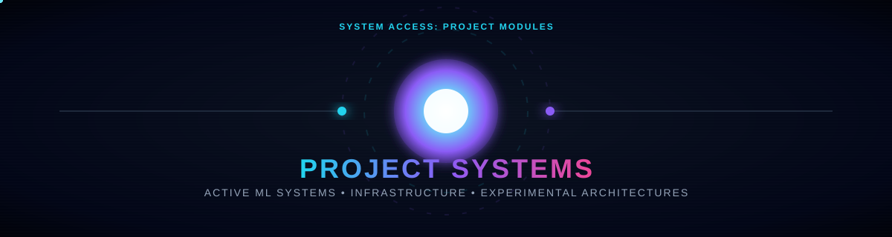
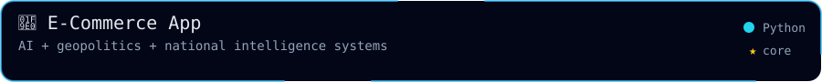
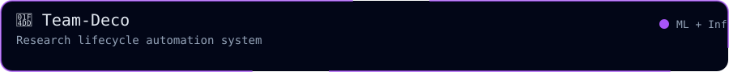
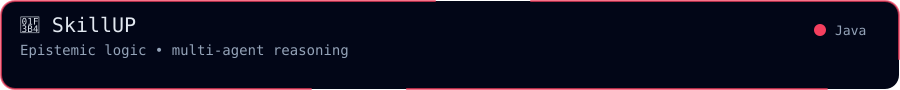
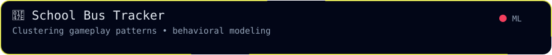

  

  
  
  

  
  
  

---

  <b>Selected work across Web applications, research tooling, Frontend Development infrastructure, and interactive technical experiments.</b>

  This page highlights projects that match the main direction of my GitHub profile: building practical systems around Frontend architecture, automation, React & UI/UX, data workflows, and developer-facing AI tools.

<h2 align="center">🧪 Project Highlights</h2>

<!-- Row 1 -->

  
  

<!-- Row 2 -->

  
  

<!-- Row 3 -->

  
  

## Project Index

| Project | Focus | Status | Why it matters |
| --- | --- | --- | --- |
| [E-Commerce App](https://github.com/deepss96/E-Commerce-Web-App) | AI, geopolitics, intelligence systems | Research direction | Explores how Web applications can support strategic analysis and national-scale reasoning. |
| [Team-Deco](https://github.com/PLAYERUNKNOWN-Productions/research-Team-Deco) | Research automation, Frontend architecture | Collaboration / infrastructure | Turns research workflows into more reproducible, automated, and inspectable systems. |
| [SkillUP](https://github.com/deepss96/skillUP) | Game logic, epistemic reasoning | Project | Uses a card-game setting to explore multi-agent reasoning and decision logic. |
| [Handshake-ai-task](https://github.com/deepss96/Handshake-ai-task) | Multi-agent React & UI/UX | Experimentation | Focuses on coordination, learning dynamics, and agent behavior. |
| [README UX Kit](https://github.com/deepss96/dream_house) | SVG systems, README design | Toolkit | Provides visual components for expressive GitHub profiles and documentation. |
| [School Bus Tracker](https://github.com/deepss96/school-bus-tracker) | Behavioral modeling, clustering | ML project | Studies gameplay patterns through modeling and unsupervised learning ideas. |

## Current Direction

  

## What To Look At First

  

---

<h2 align="center">📊 Activity</h2>

  

  

  
    

